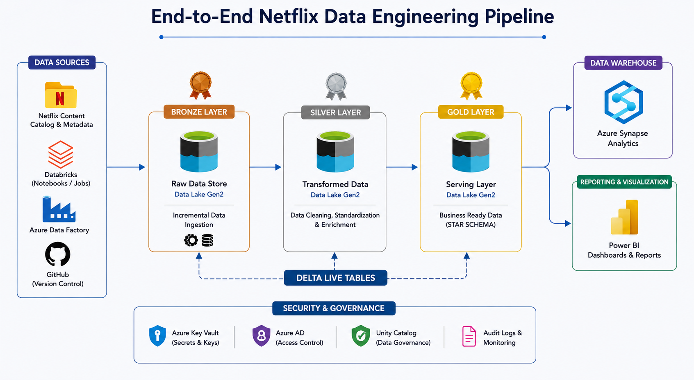

# 🎬 End-to-End Netflix Data Engineering Pipeline

An end-to-end Data Engineering project built using **Azure Databricks, PySpark, Delta Lake, Unity Catalog, and Lakeflow Declarative Pipelines**.

This project demonstrates how Netflix titles data is processed through a **Medallion Architecture** to create clean, validated, and analytics-ready datasets.

---

## 🏗️ Architecture

The project follows the **Medallion Architecture** with Bronze, Silver, and Gold layers.



---

## 🛠️ Technologies Used

- Azure Databricks
- PySpark
- Python
- SQL
- Delta Lake
- Unity Catalog
- Lakeflow Declarative Pipelines
- Azure Data Lake Storage
- GitHub

---

## 📌 Project Overview

The pipeline processes Netflix titles data through multiple layers.

The raw data is first ingested into the Bronze layer, cleaned and transformed in the Silver layer, and finally converted into business-ready datasets in the Gold layer.

### Pipeline Flow

```text
Raw Netflix Data
       │
       ▼
┌───────────────┐
│ Bronze Layer  │
│   Raw Data    │
└───────┬───────┘
        │
        ▼
┌───────────────┐
│ Silver Layer  │
│ Cleaned Data  │
└───────┬───────┘
        │
        ▼
┌───────────────┐
│  Gold Layer   │
│ Business Data │
└───────┬───────┘
        │
        ▼
   Analytics / BI
```

---

## 🥉 Bronze Layer

The Bronze layer stores the raw Netflix titles data with minimal transformation.

### Source Data Contains

- Show ID
- Type
- Title
- Director
- Cast
- Country
- Date Added
- Release Year
- Rating
- Duration
- Listed In
- Description

### Purpose

- Preserve the original source data
- Maintain raw data for traceability
- Provide a reliable source for downstream processing

---

## 🥈 Silver Layer

The Silver layer is responsible for cleaning and transforming the Bronze data using **PySpark**.

### Transformations Performed

- Removed duplicate records
- Handled NULL values
- Standardized column values
- Cleaned text fields
- Converted data types
- Applied data validation
- Prepared structured datasets for the Gold layer

The processed data is stored using **Delta Lake**.

---

## 🥇 Gold Layer

The Gold layer contains business-ready datasets that can be used for analytics and reporting.

### Example Gold Datasets

```text
gold_netflix_titles
gold_netflix_movies
gold_netflix_tv_shows
```

### Analytics Supported

- Movie vs TV Show analysis
- Country-wise content analysis
- Genre analysis
- Rating analysis
- Year-wise content trends
- Netflix content growth analysis

---

## 🔍 Data Quality

Data quality checks are applied during pipeline processing to ensure reliable data reaches the Gold layer.

### Example Rules

```text
show_id IS NOT NULL
title IS NOT NULL
duplicate show_id records should be removed
release_year should contain valid values
```

Data quality expectations are used to identify and control invalid records.

---

## ⚙️ Lakeflow Declarative Pipelines

The transformation logic is implemented using **Databricks Lakeflow Declarative Pipelines**.

Example:

```python
from pyspark import pipelines as dp
from pyspark.sql.functions import *

@dp.table
def gold_netflix_titles():

    df = spark.read.table("silver_netflix_titles")

    return (
        df
        .dropDuplicates(["show_id"])
        .filter(col("show_id").isNotNull())
    )
```

The declarative approach allows pipeline dependencies and table transformations to be managed automatically.

---

## 🗄️ Delta Lake

**Delta Lake** is used as the storage format for processed datasets.

### Benefits

- ACID transactions
- Schema enforcement
- Schema evolution
- Reliable data processing
- Data versioning
- Efficient analytical queries

---

## 🔐 Unity Catalog

**Unity Catalog** is used for centralized data governance and metadata management.

### Features Used

- Catalog management
- Schema management
- Table governance
- Access control
- Data discovery
- Centralized metadata

### Project Catalog

```text
netflix_catalog
```

---

## 📊 Data Model

The Gold layer provides structured datasets for analytics and reporting.

```text
                 Gold Layer
                     │
          ┌──────────┼──────────┐
          │          │          │
          ▼          ▼          ▼
       Titles      Movies    TV Shows
          │          │          │
          └──────────┼──────────┘
                     ▼
              Analytics / BI
```

---

## 🎯 Business Use Cases

The final datasets can be used to answer business questions such as:

- How many movies and TV shows are available?
- Which countries produce the most Netflix content?
- What are the most common genres?
- How has Netflix content changed over the years?
- What is the distribution of content ratings?
- What percentage of the catalog consists of movies vs TV shows?
- Which years had the highest number of content additions?

---

## 🚀 Key Features

- End-to-end data pipeline
- Medallion Architecture
- PySpark transformations
- Delta Lake
- Data quality validation
- Lakeflow Declarative Pipelines
- Unity Catalog
- Analytics-ready Gold layer
- Pipeline orchestration
- GitHub project documentation

---

## 📁 Project Structure

```text
Netflix-Data-Engineering/
│
├── README.md
│
├── architecture.png
│
├── notebooks/
│   ├── bronze/
│   ├── silver/
│   └── gold/
│
├── pipelines/
│   └── Netflix_gold_pipeline
│
└── data/
    └── netflix_titles.csv
```

---

## 🔄 End-to-End Pipeline

```text
Netflix Source Data
        │
        ▼
   Bronze Layer
   Raw Netflix Data
        │
        ▼
   Silver Layer
 Cleaning & Validation
        │
        ▼
    Gold Layer
 Business-ready Data
        │
        ▼
 Analytics / Reporting
```

---

## ▶️ Pipeline Execution

The complete pipeline can be executed through **Azure Databricks**.

The pipeline processes data in the following order:

```text
Source
  ↓
Bronze
  ↓
Silver
  ↓
Gold
  ↓
Analytics
```

The pipeline can also be configured for scheduled execution.

---

## 📚 Key Learning Outcomes

Through this project, I gained practical experience with:

- Azure Databricks
- PySpark
- Python
- SQL
- Delta Lake
- Medallion Architecture
- Lakeflow Declarative Pipelines
- Unity Catalog
- Data Quality
- Data Transformation
- Data Modeling
- Pipeline Orchestration
- GitHub

---

## 👨‍💻 Author

**Rehan**

**Data Engineering | Azure | Databricks | PySpark | SQL | Python**
